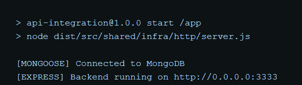
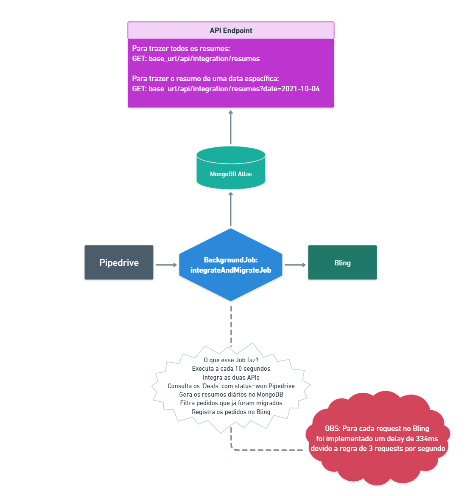
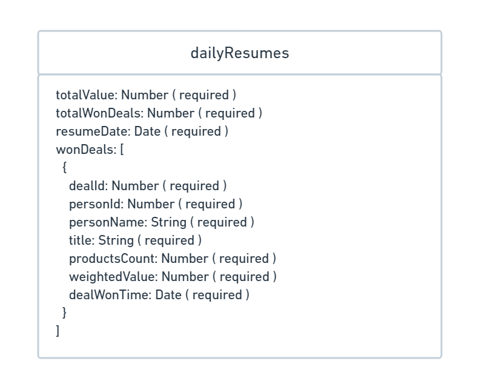

# Projeto de uma API RESTful para integração entre Pipedrive e Bling

## Desenvolvida utilizando as tecnologias TypeScript, NodeJS, Express, Mongoose, Axios, Node-schedule 🛠

[](https://www.typescriptlang.org/) [](https://nodejs.org/en/) [](https://docs.mongodb.com/) [](https://mongoosejs.com/docs/)

Uma API RESTful que tem a função de integrar o CRM da Pipedrive com o ERP da Bling, durante a integração a API migra os 'Deals' com "status=won" e gera novos Pedidos no Bling, tudo isso é feito utilizando as tecnologias JavaScript, TypeScript, NodeJS, Babel, Express, Mongoose, Axios, Node-schedule 🛠

O projeto foi desenvolvido utilizando a arquitetura ou `design pattern` padrão `DDD`, aplicando os conceitos de `CleanArchture`, `CleanCode` e `SOLID`.

#### Requerimentos ✅

| Requerimento  | Uso |
| ------------- | -------------- |
| Yarn 1.1x     | Execução da aplicação e realização do deploy local |
| Docker 3.x    | Containerização e execução da aplicação |
| Node 12.x     | Executar a aplicação de forma local |
| Postman ^4.4.3 | Realizar requests à API |

#### Requisitos do desafio ✅

| Status | Requisitos |
| ------------- | -------------- |
| ✅     | Criar contas testes nas plataformas Pipedrive e Bling. |
| ✅    | Criar uma integração entre as plataformas Pipedrive e Bling (A integração deve buscar as oportunidades com status igual a ganho no Pipedrive, depois inseri-las como pedido no Bling). |
| ✅    | Criar banco de dados Mongo, existem serviços como MongoDB Atlas para criar de graça. |
| ✅ | Criar uma collection no banco de dados MongoDB agregando as oportunidades inseridas no Bling por dia e valor total. |
| ✅ | Criar endpoint para trazer os dados consolidados da collection do MongoDB. |

### Variáveis de ambiente

| NOME | DESCRIÇÃO |
| --- | --- |
| APP_URL | URL que a aplicação irá ser executada. |
| APP_PORT | Porta que a aplicação ficará disponível. |
| MONGODB_URI | URI de acesso do MongoDB, deve conter usuário e senha na URI. este pode ser um MongoDB local ou Mongo Atlas |
| PIPEDRIVE_API_URL | URL da API do Pipedrive. |
| PIPEDRIVE_API_TOKEN | Token de acesso a API do Pipedrive. |
| BLING_API_URL | URL da API do Bling. |
| BLING_API_KEY | Key de acesso a API do Pipedrive. |

#### OBS: Apenas subi o arquivo .env junto com a aplicação para facilitar a execução da mesma.

## Containerização da aplicação utilizando o Docker 🐳
[](https://docs.docker.com/)

#### 🔴 OBS: Recomendo fortemente utilizar o Docker para executar a aplicação por questões de performance

Após clonar o repositório, acesse a pasta via terminal e execute o seguinte comando:

```bash
yarn deploy:docker
```
ou
```bash
npm run deploy:docker
```
> Este comando no instala as dependências, cria uma build nova da aplicação, em seguida exclui o container do Docker caso exista e depois recria um container com a aplicação executando em um NodeJS de uma imagem da distribuição Alpine do linux.


> Após a execução o container api-integration será criado no seu Docker

### Verificando se a aplicação está executando corretamente 🐳

Agora abra a sua aplicação do `Docker` e clique no container `api-integration` ➡ `api-marlon`, e deverá ver os seguintes logs:



> Se tudo estiver executando perfeitamente os logs da imagem acima deverão ser exibidos.

## Execução da aplicação de forma local via terminal 🖥

```bash
yarn deploy
```
ou
```bash
npm run deploy
```

## Agora vamos direto ao Endpoint (badum tiss 🥁)

**GET** Consultar todos os resumos diários:

```
/api/integration/resumes
```
Ou consultar um resumo pela data: (AAAA-mm-dd)
```
/api/integration/resumes?date=2021-10-04
```
### Para obter a documentação da Api e executar o endpoint no Postman basta clicar no botão abaixo:

[](https://tinyurl.com/api-integration)

## Arquitetura da Aplicação



## Estrutura do Banco 🗃



## Entendendo a estrutura de pastas 🗂

### Pasta raiz do projeto 📁
```
    ├── .github        # Arquivos utilizados pelo GitHub
    ├── src            # Arquivos de Recursos da aplicação
    │   ├── modules    # Módulos da aplicação onde se encontrão os domínios
    │   └── shared     # Pasta com os recursos compartilhados entre os domínios
    └── ...
```

### Pasta de Modules 📁

```
├── modules          # Módulos da aplicação
│   ├── dailyResume  # Módulo de resumos diários/ entidade dailyResumes
│   ├── integration  # Módulo de integração/ lógica de negócio da integração completa
└── ...
```

### Dentro de um módulo 📁

```
    ├── ...
    ├── dailyResume       # Módulo de resumos diários/ entidade dailyResumes
    │   ├── dtos          # Pasta onde ficam os Data Transfer Objects
    │   ├── infra         # Infra específico do módulo
    │   ├── repositories  # Repositórios dos resumos diários
    │   ├── useCases      # UseCases com as regras de negócio do domínio e testes unitários
    │   └── utils         # Utils específico do módulo
    └── ...
```

### Dentro da pasta infra de um módulo 📁

```
        ├── ...
        ├── infra                 # Infra específico do módulo
        │   ├── http              # Recursos HTTP do domínio
        │   │   ├── controllers   # Controllers das requisições das rotas
        │   │   └── routes        # Rotas de dailyResumes
        │   └─── mongoose         # Recursos isolados do Mongoose
        │       ├── entities      # Schemas/entidades do domínio específicas do Mongoose
        │       └── repositories  # Repositórios isolados com os métodos do Mongoose
        └── ...
```

### Dentro da pasta shared 📁

```
  ├── ...
  ├── shared                  # Shared recursos compartilhados entre os domínios
  │   ├── containers          # Container com as injeções de dependências dos repositórios
  │   │   └── providers       # Providers compartilhados entre os módulos
  │   ├── errors              # Configuração de mensagens de erros retornadas
  │   └── infra               # Infra da aplicação como um todo
  │       ├── http            # Configurações HTTP da aplicação routes/server
  │       │   ├── app         # Instância da aplicação
  │       │   └── routes      # Instância de rotas de cada módulo da aplicação
  │       └── mongoose        # Configuração do Mongoose para conexão com o MongoDB
  └── ...
```
